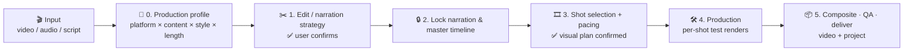

# Xumu (序幕)

<p align="center">
  <a href="./README.md"></a>
  <a href="./README.en.md"></a>
</p>


> 📘 **Usage guide (Chinese): [docs/USAGE.md](./docs/USAGE.md)**

**Xumu** ("序幕", *prologue*) is a **talking-head video production skill pack** for AI agents such as Claude, GPT and Doubao. Hand it **a talking-head video, a voice recording or a script**, and the agent first works out *where it will be published, what it says, what style it needs and how long it should run* — then edits, picks shots, builds custom motion graphics (MG), adds captions, composites, and delivers **the finished video plus an editable project**.

It is not a one-click black box but a director workflow with confirmation points:

- **Plan before cutting** — a production profile (platform × content × style × length) drives narrative structure, edit strategy and shot intensity.
- **Not everything becomes a card** — keeping the speaker on screen or adding no animation are valid choices; only segments that need motion get shots.
- **Shots with provenance** — compare first choices and alternatives from 157 cinematic shot-recipe cards; write custom MG only when there is a real expressive gap.
- **Verifiable at every step** — one master timeline, per-shot test renders, a plan checker, and review of real renders.

> Distilled by **VVAI** from real talking-head video production, integrating and adapting [Video Use](https://github.com/browser-use/video-use) (MIT) and [Video Shotcraft](https://github.com/Vincentwei1021/video-shotcraft) (Apache-2.0).

## Workflow



## Quick start (30 seconds)

Whether you use **Claude, GPT, Doubao** or another AI, as long as it can read/write files and run commands (agent / coding mode), just send it this:

```text
Install the "Xumu" talking-head video skill pack for me. Clone https://github.com/cecilPENG53/xumu
into a temp directory, then copy the three folders xumu, video-use and video-shotcraft under skills/
into your skills directory (e.g. ~/.claude/skills/ or ~/.codex/skills/; other agents: wherever they
load skills from). When done, check that each of the three folders contains SKILL.md.
```

After installing, tell your AI:

```text
Use Xumu to turn D:\footage\talk01.mp4 into a ~3-minute 16:9 explainer for YouTube. Show me the production plan first.
```

More things to try:

```text
Turn podcast.m4a into a vertical video for TikTok. Keep the original voice; visuals should be illustrations + diagrams.
I only have a script, script.md. Draft a storyboard and shot plan first — don't generate a voiceover yet.
Make the three data-heavy segments of this talk into animated charts; keep the speaker on screen elsewhere.
This is my previous project, outputs/ai-agents/edit/. Tighten the pacing of chapter 3 and re-export.
```

## What's inside

A pack of **3 skills**. Normally you only start from the director entry point; it calls the other two when needed:

| Skill | Role |
|---|---|
| 🎛 **xumu** | **Director entry point**: production profile, edit strategy, shot selection, master timeline, QA and delivery |
| ✂️ **video-use** | Editing tools: transcription, cutting, grading, subtitle burn-in (based on browser-use/video-use) |
| 🎞 **video-shotcraft** | Shot library: 157 shot-recipe cards, Remotion components & template, motion workbench (based on Vincentwei1021/video-shotcraft) |

> 💡 **How to invoke**: the simplest way is to tell your AI "Use Xumu to …". You can also use commands: `/xumu` in Claude (`/xumu:xumu` when installed as a plugin — plugin name before the colon, skill name after), and `$xumu` in GPT (Codex).

## Features

- 🎙 **Three inputs**: talking-head video (edit the footage) / recording (full-length visuals) / script only (record later, synthetic voiceover, or no narration)
- 🧭 **Production profile**: narrative structure decided by audience, platform, content type, style intensity and target length; short pieces and chaptered long-form planned differently
- ✂️ **Voice-first editing**: verbatim transcription, cuts aligned to word boundaries, tone and intent preserved; ElevenLabs optional, free local faster-whisper by default
- 🎞 **Content-driven shots**: 157 Shotcraft shot-recipe cards (openings, camera moves, transitions, data, typography, rhythm…), comparing first choice and alternatives before committing
- ✨ **Custom MG**: 32 curated inspiration entries + brief template + a **frame-deterministic rendering contract** (every frame depends only on its frame number)
- 🧱 **One master timeline**: `visual-plan.json` + `plan_tools.py` structural checks and hand-off manifest export
- 🔌 **Optional extensions**: if HyperFrames is installed, it is used only for behind-subject captions, effects Shotcraft lacks, or music/SFX
- 🛠 **One-command setup**: `setup_env.py` detects and installs FFmpeg, Python deps and faster-whisper, and checks Node.js

## Good fit / not a fit

**✅ Good fit**: educational talking-head / commentary / tutorials / podcast clips / product and proposal explainers / chaptered long-form video

**❌ Not a fit**: music videos / multi-camera film editing / people who want a double-click editing app / environments where the agent cannot run commands

## Common scenarios

| Task | Recommended approach |
|------|---------|
| Polish and package a talking-head video | Video mode: confirm the cut strategy first; keep speaker segments; data/process segments get shots or MG |
| Turn a podcast / recording into a video | Audio mode: keep the original voice; visuals must **cover the full length** (illustration, screen recording, diagrams, designed backgrounds) |
| Script only | Script mode: structure and storyboard first; then record later, synthetic voiceover, or a caption-only video |
| Explaining data or processes | Compare Shotcraft data/typography recipes first; write a custom MG brief only if they fall short |
| Long-form (10 min+) | Chaptered planning, each chapter with its own pacing and return-to-speaker beats |
| Revise an existing project | Point the agent at the project's `edit/` folder; only affected shots and captions are redone, unchanged sources are not re-transcribed |

## Usage rules (summary)

Full version (Chinese): **[docs/USAGE.md](./docs/USAGE.md)**.

1. **State four things up front**: platform, audience, style and rough length. The agent asks about what's missing — but only what would change the result.
2. **Two confirmation points are mandatory**: the edit/narration strategy and the full visual plan. A vague "make a video" is not approval to cut.
3. **Source footage is never overwritten**: all outputs go to `edit/` next to your footage, or `outputs/<project-name>/edit/`.
4. **Permissions stay scoped**: publishing, voice cloning, uploading media and paid generation each need your separate approval; API keys live only in environment variables, never in plans or logs.
5. **Bring your own licensed audio**: this repo ships **no** third-party music or SFX.
6. **Judge real renders**: a passing `plan_tools.py check` means the structure is valid, not that the video is good.

## Platform support

| AI | Status | Notes |
|------|------|------|
| Claude (Claude Code / desktop Cowork) | Supported | Can be installed as a plugin in one step; invoke with `/xumu` |
| GPT (Codex) | Supported | Place in `~/.codex/skills/`; trigger with `$xumu` |
| Doubao | Usable | Requires an agent / coding mode that can read/write files and run commands |
| Cursor / other AI agents | Usable | Must be able to read/write files and run shell commands |
| Plain chat | Not recommended | No file system or shell, so no editing or rendering |

> One rule decides it: **can your AI read/write files and run commands on your computer?** If yes, it can run Xumu.

## Installation

### Option 1: send this to your AI (universal, recommended)

> Install the "Xumu" skill pack for me:
>
> 1. Run `git clone https://github.com/cecilPENG53/xumu.git` into a temp directory
> 2. Find the directory you load skills from; create it if it doesn't exist
> 3. Copy **all three folders** `skills/xumu`, `skills/video-use` and `skills/video-shotcraft` into it
> 4. Verify each folder contains `SKILL.md`
> 5. Tell me when it's done; from then on, saying "turn this talk into a video" will trigger it

### Option 2: manual command line

macOS / Linux:

```bash
git clone https://github.com/cecilPENG53/xumu.git
cp -r xumu/skills/* ~/.claude/skills/
```

Windows (PowerShell):

```powershell
git clone https://github.com/cecilPENG53/xumu.git
Copy-Item -Recurse xumu\skills\* "$HOME\.claude\skills\"
```

The example uses Claude's `~/.claude/skills/`; for GPT (Codex) use `~/.codex/skills/`, for other AIs use the directory they load skills from.

### Option 3: Claude plugin commands (Claude Code only)

```text
/plugin marketplace add cecilPENG53/xumu
/plugin install xumu@vvai
```

Update: `/plugin marketplace update vvai`

> ⚠️ **All three skills must live in the same `skills/` directory.** The director skill finds video-use and video-shotcraft as siblings; it never relies on absolute paths from the author's machine.

### Requirements

| Dependency | Purpose | How to get it |
|---|---|---|
| Python 3.10+ | Editing, transcription, plan checks | Install yourself |
| FFmpeg / ffprobe | Media processing and compositing | Installed by `setup_env.py` |
| faster-whisper | Free local transcription | Installed by `setup_env.py` |
| Node.js 18+ | Remotion animation rendering | Install yourself; `setup_env.py --remotion` pre-fetches deps |
| ElevenLabs API key | Optional: cloud transcription + speaker diarization | Set the `ELEVENLABS_API_KEY` environment variable |

The agent runs the environment check automatically the first time it actually produces something; you can also run it by hand:

```bash
python skills/xumu/scripts/setup_env.py --check   # report only, install nothing
python skills/xumu/scripts/setup_env.py            # install whatever is missing
python skills/xumu/scripts/setup_env.py --remotion # when Remotion animation is needed
```

## Repository layout

```text
xumu/
├── .claude-plugin/
│   ├── plugin.json            # plugin manifest
│   └── marketplace.json       # marketplace manifest (for /plugin marketplace add)
├── skills/
│   ├── xumu/                  # 🎛 director: SKILL.md + references/ + scripts/
│   ├── video-use/             # ✂️ editing helpers (MIT, original license kept)
│   └── video-shotcraft/       # 🎞 shot cards + Remotion source (Apache-2.0, original license kept)
├── docs/USAGE.md              # usage guide (Chinese)
├── CONTRIBUTING.md            # contributing guide
├── THIRD_PARTY_NOTICES.md     # third-party sources and licenses
└── LICENSE                    # MIT (covers VV original work only)
```

## Project outputs

Each video project produces, under `edit/` (generated as needed, never pre-filled with made-up results):

| File | Purpose |
|---|---|
| `project.md` | Production profile, confirmations, notes for picking up later |
| `edl.json` | Edit decision list (when Video Use is used) |
| `visual-plan.json` | **The one master timeline**: frame-level timing and shots |
| `assets.json` | Asset sources and licenses |
| `shots/<shot_id>/` | One folder per shot; custom MG includes `brief.md` |
| `verify/` | QA evidence |

## License & credits

- VV original work (`skills/xumu/`, root docs and config) is open-sourced under [MIT](./LICENSE).
- [`skills/video-use/`](./skills/video-use/) comes from [browser-use/video-use](https://github.com/browser-use/video-use) and keeps its MIT license.
- [`skills/video-shotcraft/`](./skills/video-shotcraft/) comes from [Vincentwei1021/video-shotcraft](https://github.com/Vincentwei1021/video-shotcraft) and keeps its Apache-2.0 license; the upstream Mixkit SFX/music are **not redistributed** here.
- See [THIRD_PARTY_NOTICES.md](./THIRD_PARTY_NOTICES.md).

Issues and PRs are welcome — see [CONTRIBUTING.md](./CONTRIBUTING.md).
